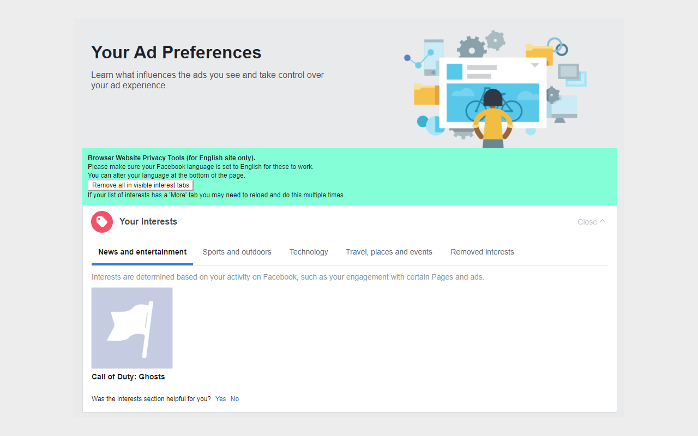

# Facebook advert interest cleaner

A browser extension that provides a small button to easily clear all of your Facebook advert interests.

**Note: Facebook likes to change its UI lots** which might break this extension. If it doesn't work for you [please file an issue](https://github.com/addshore/browser-facebook-advert-interest-cleaner/issues)!

## How to install?

Download it from:

 - Chrome: https://chrome.google.com/webstore/detail/facebook-advert-interest/nheaildopjpofjpkeihboipgnagofndi
 - Mozilla:  https://addons.mozilla.org/en-US/firefox/addon/facebook-ad-interest-cleaner/
 - Edge: https://microsoftedge.microsoft.com/addons/detail/jfjcfgaegiecjgaimdiadeokpipdmeli
 - Opera: Still pending?

## How to use it?

 1) Install the extension from the browser store
 2) Switch Facebook to a supported language (Current en_US, en_GB, de_DE, fr_FR, pt_BR, pt_PT, tr_TR)
 3) Navigate to your [Facebook advert settings](https://www.facebook.com/adpreferences/ad_settings)
 4) Navigate to the interests section (Categories used to reach you >> Interest Categories)
 5) Click the button provided by the extensions to clear all of your interests!

You can also navigate to the "Other Categories" section in English and find a similar button.

## What does it look like?

## How does it work?

Facebook doesn't provide the easiest UI to write extensions for.

This extension runs on a set of specific Facebook pages and finds the elements of a page that it needs to interact with by using the textual content.

It looks for `Interest Categories` first, then looking for the buttons that it will need to click.

This means that each language needs extra work to be supported, and if the text or page ever change further changed might be needed.

## Further language support

In order for more languages to be supported the text of some UI elements on the Facebook page must be added to the extension code.

These texts, along with the language code must be added [here](https://github.com/addshore/browser-facebook-advert-interest-cleaner/blob/master/app/scripts/adpreferences-ad_settings.js).

If you don't want to touch the code, just file an [issue](https://github.com/addshore/browser-facebook-advert-interest-cleaner/issues) requesting the language support, including the strings you have collected.

## Development

This extension uses [webextension-toolbox](https://github.com/HaNdTriX/webextension-toolbox)

    $ npm install

### While developing

    npm run dev chrome
    npm run dev firefox
    npm run dev opera
    npm run dev edge

### For builds

Make sure you update the version number everywhere & the date that is displayed in the UI.

    npm run build chrome
    npm run build firefox
    npm run build opera
    npm run build edge

These commands will output built files to the `dist` directory, but also zips to `packages`.

### For releasing

- Bump the version number in:
  - package.json
  - manifest.json
- Update the CHANGELOG.md
- Update the version in the text in the main JS file
- Tag the change on Github (vx.x.x)
- Wait for the [Github actions](https://github.com/addshore/browser-facebook-advert-interest-cleaner/actions) to build the files
- See the [STORE_NOTES.md](./STORE_NOTES.md) file for helpful details on uploading...

### Environment

The build tool also defines a variable named `process.env.NODE_ENV` in your scripts. 

## Icon

The Icon was created using some GPL licensed icons:
 - https://www.iconfinder.com/icons/1054970/layers_stack_icon
 - https://www.iconfinder.com/icons/1055074/block_denied_no_no_symbol_stop_universal_no_icon
 - https://www.iconfinder.com/icons/1055113/bicycle_bike_biker_icon
 - https://www.iconfinder.com/icons/1055073/coding_programming_tags_icon
 - https://www.iconfinder.com/icons/1055063/heel_high_heel_shoe_icon

The SVG for the icon can be found in the media directory.