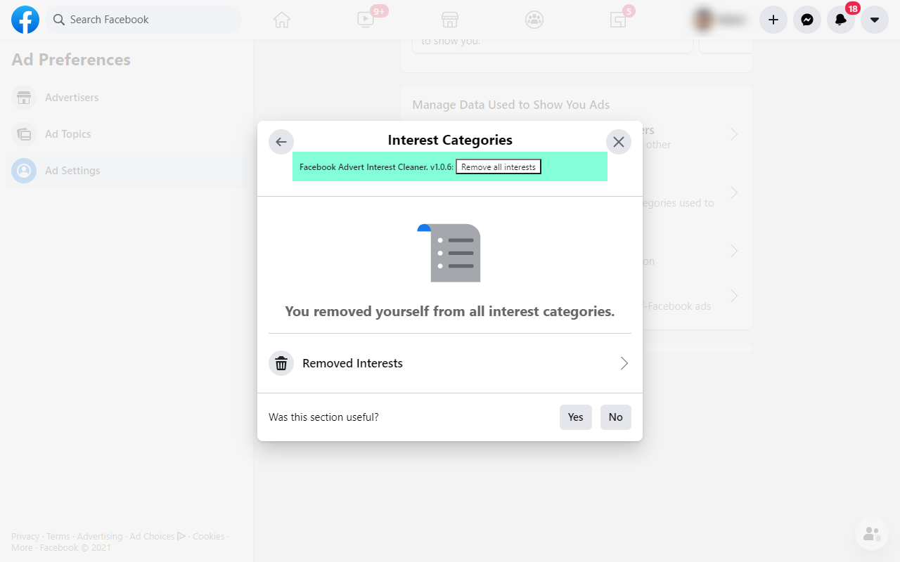

# Facebook advert interest cleaner

A browser extension that provides a small button to easily clear all of your Facebook advert interests.

**Note: Facebook likes to change its UI lots** which might break this extension. If it doesn't work for you [please file an issue](https://github.com/addshore/browser-facebook-advert-interest-cleaner/issues)!

## How to install?

Download it from:
 - Chrome: https://chrome.google.com/webstore/detail/facebook-advert-interest/nheaildopjpofjpkeihboipgnagofndi
 - Mozilla:  https://addons.mozilla.org/en-US/firefox/addon/facebook-ad-interest-cleaner/
 - Edge: https://microsoftedge.microsoft.com/addons/detail/jfjcfgaegiecjgaimdiadeokpipdmeli
 - Opera: Still pending?

## How it works?

 1) Install the extension from the browser store
 2) Navigate to your [Facebook advert settings](https://www.facebook.com/adpreferences/ad_settings)
 3) Navigate to the interests section (Categories used to reach you >> Interest Categories)
 4) Click the button provided by the extensions to clear all of your interests!

## What does it look like?

## Icon

The Icon was created using some GPL licensed icons:
 - https://www.iconfinder.com/icons/1054970/layers_stack_icon
 - https://www.iconfinder.com/icons/1055074/block_denied_no_no_symbol_stop_universal_no_icon
 - https://www.iconfinder.com/icons/1055113/bicycle_bike_biker_icon
 - https://www.iconfinder.com/icons/1055073/coding_programming_tags_icon
 - https://www.iconfinder.com/icons/1055063/heel_high_heel_shoe_icon

The SVG for the icon can be found in the media directory.

## Development

This extension uses [webextension-toolbox](https://github.com/HaNdTriX/webextension-toolbox)

    $ npm install

### While developing

    npm run dev chrome
    npm run dev firefox
    npm run dev opera
    npm run dev edge

### For builds

MAke sure you update the version number everywhere & the date that is displayed in the UI.

    npm run build chrome
    npm run build firefox
    npm run build opera
    npm run build edge

These commands will output built files to the `dist` directory, but also zips to `packages`.

### For releasing

- Bump the version number in:
  - package.json
  - manifest.json
- Update the CHANGELOG
- Update the version in the text in the main JS file
- Build all of the versions
- Upload to the various stores
  - [Chrome](https://chrome.google.com/webstore/devconsole)
  - [Mozilla](https://addons.mozilla.org/en-US/developers/)
  - [Edge](https://partner.microsoft.com/en-us/dashboard/microsoftedge/overview)
  - [Opera](https://addons.opera.com/developer/)

### Environment

The build tool also defines a variable named `process.env.NODE_ENV` in your scripts. 
